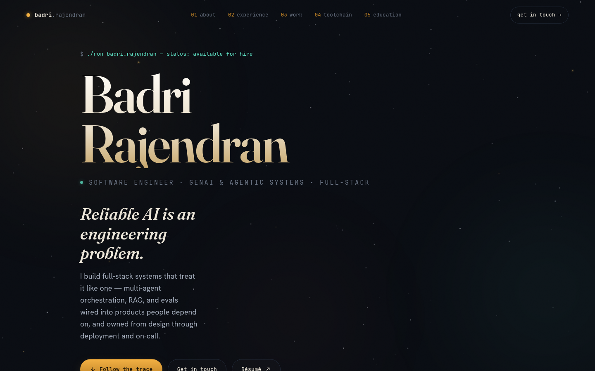

# Badri Rajendran — Developer Portfolio

> **Reliable AI is an engineering problem. I build full-stack systems that treat it like one.**

A personal portfolio for a software engineer working on **GenAI & agentic systems**. The whole page is built as a single, dependency-free `index.html` and renders like an *agent execution trace* — a gold SVG filament draws itself down the page as you scroll, a comet-head walks its leading edge, and each section ignites as a node in the graph. Over a living night-sky background, the cursor is replaced by a glowing star that trails stardust.

<p align="center">
  <a href="https://badri-narayanan.github.io"></a>
  
  
  
  
  
</p>

<p align="center">
  <a href="https://badri-narayanan.github.io"><strong>🔭 View the live site →</strong></a>
</p>



---

## ✨ Highlights

- **A scroll-following SVG path** — a single filament is generated through anchor points with Catmull-Rom smoothing, drawn on scroll via `stroke-dashoffset`, with a traveling comet-head (`getPointAtLength`) and section nodes that activate as you arrive.
- **A night-sky star-trail cursor** — the native cursor is hidden and replaced by an eased glowing star that trails gold stardust, chased by a small 5-star constellation with spring physics; background stars brighten and lean toward the pointer as it passes.
- **Data-driven content** — every project, role, and skill lives in one `DATA` object. Adding a project is a one-object edit; no markup to touch.
- **Zero build, zero dependencies** — one self-contained `index.html`. Drop it on any static host and it just works.
- **Responsive & accessible** — fluid layouts, a mobile menu, `focus-visible` styles, and full `prefers-reduced-motion` support that disables the trail/animation and restores the native cursor.

---

## 🧠 The concept

Most engineering portfolios reach for the same dark-mode-plus-neon template. This one is built around a single idea drawn from the work it showcases: **the page behaves like an agent execution trace.**

As you scroll, a gold filament threads the page top to bottom, weaving left and right through each section. A comet-head rides its leading edge, and every section is a *node* in the graph that lights up the moment the trace reaches it. It's a small piece of narrative that ties the visual design directly to the domain — multi-agent orchestration, graphs, and execution flow — instead of decorating around it.

---

## 🛠️ Built with

| Layer | Choice | Why |
| --- | --- | --- |
| Markup & styles | **Vanilla HTML + CSS** | No framework tax; ships as static files, loads instantly. |
| Scroll trace | **SVG** + `getTotalLength` / `getPointAtLength` | Crisp at any zoom; precise control over draw progress and node timing. |
| Night sky & cursor | **Canvas 2D** + `requestAnimationFrame` | Smooth many-particle animation that SVG can't match at this density. |
| Reveal & scroll-spy | **IntersectionObserver** | Cheap, jank-free section reveals and active-nav tracking. |
| Type | Fraunces · Hanken Grotesk · JetBrains Mono | Editorial display, clean body, monospace "machine voice." |
| Hosting | **GitHub Pages** | Free static hosting, no pipeline. |

---

## ⚙️ How it works

A few decisions worth calling out, since they're the interesting part:

- **Two canvases, one loop.** A background `#sky` canvas (behind content) holds the starfield and its cursor-reactive parallax; a foreground `#fx` canvas (above everything, `pointer-events: none`) draws the cursor head, stardust, and chasing constellation. Both are driven by a single animation loop.
- **DPR-aware & paused when hidden.** Canvases scale to `devicePixelRatio` (capped at 2 for performance), particle counts are bounded, and the loop pauses on `visibilitychange` to avoid burning cycles in a backgrounded tab.
- **The trace is rebuilt, not hard-coded.** The path is recomputed from live DOM positions on load, resize, and `document.fonts.ready`, so it stays aligned even as content reflows.
- **Progressive enhancement.** The custom cursor is only enabled on fine-pointer devices and when motion is allowed — so touch users and anyone with reduced-motion preferences get a clean, fully-functional fallback.

---

## 🚀 Run locally

```bash
git clone https://github.com/Badri-Narayanan/Badri-Narayanan.github.io.git
cd Badri-Narayanan.github.io

# open it directly...
open index.html            # macOS  (use 'start' on Windows / 'xdg-open' on Linux)

# ...or serve it (recommended, so relative links resolve cleanly)
python3 -m http.server 8000   # then visit http://localhost:8000
```

No install step, no bundler, no `node_modules`.

---

## 🌐 Deploy to GitHub Pages

1. Push `index.html` (plus `preview.png` and your résumé PDF) to the repo root.
2. **Settings → Pages → Source:** deploy from `main`, folder `/ (root)`.
3. If the repo is named `Badri-Narayanan.github.io`, it goes live at the root domain automatically:

```
https://badri-narayanan.github.io
```

---

## 🧩 Customizing the content

All editable content lives in a single `DATA` object near the top of the inline `<script>`, marked **`HOW TO EDIT YOUR CONTENT`**. To add a project, push one object into `DATA.projects.others`:

```js
{
  title: 'My New Project',
  subtitle: 'One-line tagline',
  blurb: "What it does — accents with <b>bold</b> and <span class='num'>40%</span>.",
  tags: ['Python', 'FastAPI'],
  lang: { name: 'Python', color: '#3572A5' },
  icon: 'graph',                       // graph | pulse | building | chart | book
  links: [{ label: 'Source', url: 'https://github.com/...', kind: 'github' }]
}
```

It renders automatically. Experience, skills, and social links are edited the same way in the same object — there's no other markup to update.

---

## 👋 About me

I'm **Badri Rajendran**, a software engineer in the San Francisco Bay Area with **4+ years** building full-stack and backend systems in Java/Spring and Python — now focused on taking generative AI from demo to production: multi-agent orchestration, RAG, LLM evals, and MCP servers, held to real reliability bars.

- 🤖 Currently building **CodeSage** — a Claude-powered multi-agent PR reviewer on LangGraph (pgvector RAG · LLM-as-Judge evals · MCP server).
- 🎓 **M.S. Computer Science**, Stevens Institute of Technology.
- 🧭 Open to full-stack & GenAI engineering roles.

📄 **[Download my résumé](BadriRajendran_Resume_SDE.pdf)**

---

## 📫 Connect

| | |
| --- | --- |
| 📧 Email | [badriathindran@gmail.com](mailto:badriathindran@gmail.com) |
| 💼 LinkedIn | [badri-narayanan-rajendran](https://www.linkedin.com/in/badri-narayanan-rajendran/) |
| 🐙 GitHub | [@Badri-Narayanan](https://github.com/Badri-Narayanan) |
| 🐦 X / Twitter | [@badhrirajen](https://x.com/badhrirajen) |
| 📺 YouTube | [@BadriRajendran](https://youtube.com/@BadriRajendran) |
| 🧮 LeetCode | [badhri_narayanan](https://leetcode.com/u/badhri_narayanan/) |
| 🏅 Codeforces | [badhrirajen](https://codeforces.com/profile/badhrirajen) |

---

## 📝 License

Released under the **MIT License** — the code is free to learn from and reuse. Please don't redeploy the site as your own personal portfolio or reuse my résumé, photos, and written content.

<p align="center"><sub>Designed & built in the Bay Area · 2026 — a page that renders as an agent execution trace.</sub></p>
